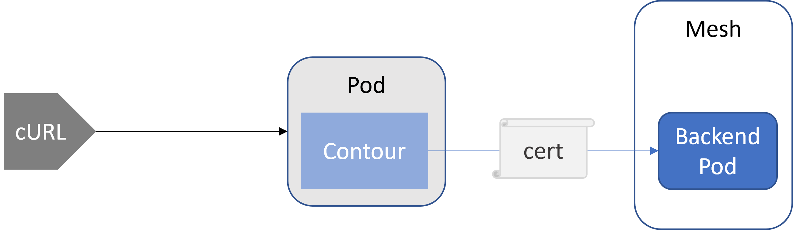
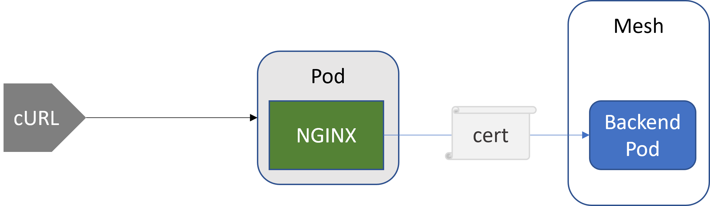
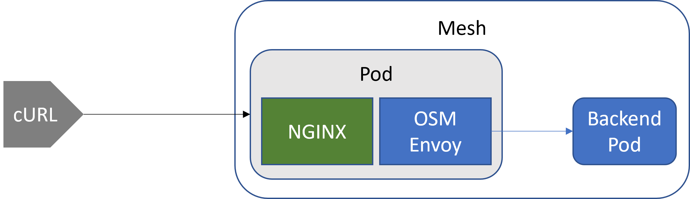

# ingress-benchmarks

This document shows benchmark results from the following 3 scenarios:

1. Contour + OSM - Contour is given an mTLS certificate to participate in the mesh


2. NGINX + OSM - NGINX is given an mTLS cert



3. NGINX in the OSM mesh - Nginx is installed in a namespace, which participates in the mesh and is sidecared with an Envoy proxy (one pod 2 proxies - one Nginx, one Envoy)



The experiment was ran on 3 unique AKS clusters with the same characteristics.
1. [run--ingress--contour.sh](./run--ingress--contour.sh)
2. [run--ingress--nginx.sh](./run--ingress--nginx.sh)
3. [run--ingress--nginx-inmesh.sh](./run--ingress--nginx-inmesh.sh)

We issue 1000 cURL commands using:
```bash
for x in $(seq 1000); do
    curl -X GET -I -H "Host: osm-bookstore.contoso.com" http://${IP}/
done
```

The results of the `cURL` command are in the following files:
1. [contour-out.tsv](./contour-out.tsv)
2. [nginx-out.tsv](./nginx-out.tsv)
3. [nginx-inmesh.tsv](./nginx-inmesh.tsv)

The `cURL` command is configured with `~/.curlrc`:
```shell
-w "dnslookup: %{time_namelookup} | connect: %{time_connect} | appconnect: %{time_appconnect} | pretransfer: %{time_pretransfer} | starttransfer: %{time_starttransfer} | total: %{time_total} | size: %{size_download}\n"
```
We get the average values for each column with:
```bash
cat nginx-inmesh.tsv | awk -v N=5 '{ sum += $N } END { if (NR > 0) print sum / NR }'
```

The cURL output is averaged in the following table:

| # | scenario | connect | pretransfer | starttransfer | total | vs NGINX inside the mesh |
|---|---|---|---|---|---|---|
|1. | Contour Outside the Mesh | 0.18523| 0.18529| 0.372467| 0.372521| 0.011 |
|2. | NGINX Outside the Mesh | 0.184945| 0.185003| 0.371933| 0.371986| 0.012 |
|3. | NGINX Inside the Mesh | 0.187595| 0.187654| 0.383522| 0.383575| |


### Conclusion
Using NGINX inside the mesh (aka sidecaring NGINX) adds 11ms latency in comparison to NGINX kept outside the mesh and given an mTLS certificate to route traffic to in-mesh pods.
